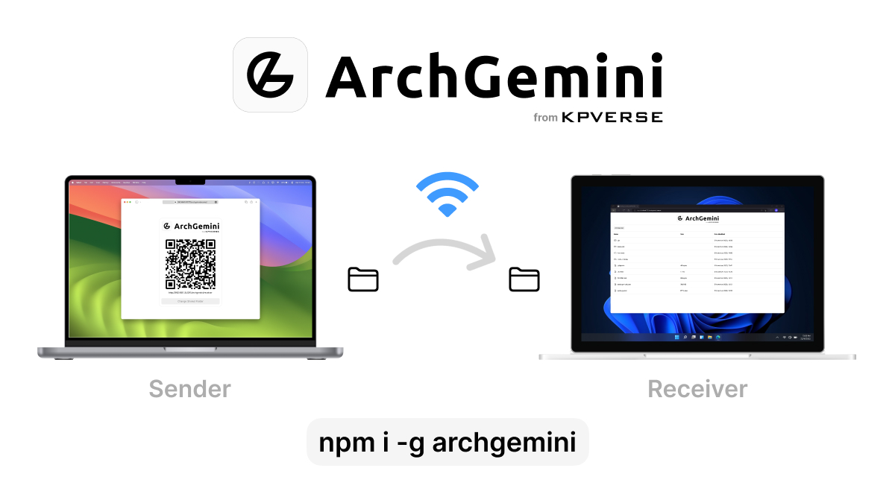

[](https://kpverse.in/archgemini "ArchGemini from KPVERSE")

<h1 align="center"><a href="https://kpverse.in/archgemini">ArchGemini</a></h1>

ArchGemini **simplifies file sharing over the local network**, providing an effortless and secure way to **share your files with connected devices**.

## Installation

To install ArchGemini, **make sure you have Node.js installed** on your system. Then run the following command:

-   Option 1 - To **install globally** in your system **(Recommended)**

```bash
# Install globally
npm install -g archgemini

# If you are installing it on macOS and Linux systems, you might need to use sudo
sudo npm install -g archgemini
```

-   Option 2 - To **install locally** in a specific project folder

```bash
# Navigate to your project directory
cd your_project_directory

# Install archgemini locally
npm install archgemini
```

-   Alternatively, you can visit [our website](https://kpverse.in/archgemini) for easy download option.

## Usage

After installation, run the following command in the terminal/command prompt/powershell to share the current working directory over the network using ArchGemini:

```bash
# If installed globally.
archgemini

# or

# If installed in a specific folder.
npx archgemini
```

-   ArchGemini is **compatible with macOS, Windows, and Linux** distributions.
-   Both the sender and receiver **devices must be connected to the same network**.

## Support and Issue Reporting

If you need assistance or want to report any issues, please visit [issues tab](https://github.com/kpverse/archgemini/issues) of our GitHub repository.

## Contributing

We welcome contributions to ArchGemini! Feel free to [fork the project](https://github.com/kpverse/ArchGemini/fork), make your improvements, and submit a [pull request](https://github.com/kpverse/ArchGemini/pulls).

## License

ArchGemini is released under the [MIT License](./LICENSE).

## Contact Information

If you have any questions or need assistance, you can reach out to us via email at [thekpverse@gmail.com](mailto:thekpverse@gmail.com).

---

<div align="center"><strong><a href="https://kpverse.in">Get more from KPVERSE</a></strong></div>
